# 🏛️ Architecture Diagrams — AI Localization Platform

**Project:** Knewron AI Localization Platform
**Client:** DeepHealth
**Date:** July 24, 2026
**Version:** 1.1
**Status:** ✅ Aligned to `LOCKED_Design_v1.0.md`; §3/§3.1 and §19 updated for the
post-implementation extensions in `Technical_Design_Document.md` §11 (Redis
externalized, multi-cloud storage/embeddings, ChromaDB tenant partition key)

> Diagrams use **Mermaid** and render in GitHub, GitLab, and VS Code (Markdown Preview Mermaid Support). Each diagram reflects the locked monolithic Python architecture.

> 📊 **Rendered diagrams:** open [`Architecture_Diagrams.html`](Architecture_Diagrams.html) in a browser for guaranteed Mermaid rendering (no VS Code extension required).

## Index

**Architecture views**
1. [System Context](#1-system-context)
2. [High-Level Layered Architecture](#2-high-level-layered-architecture)
3. [Deployment (Docker Compose)](#3-deployment-docker-compose)
3.1 [Redis Responsibilities](#31-redis-responsibilities)
4. [Universal Pipeline Stages](#4-universal-pipeline-stages)
5. [Artifact State Machine](#5-artifact-state-machine)
7. [Image Localization Sub-Pipeline](#7-image-localization-sub-pipeline)
8. [Video Localization Flow](#8-video-localization-flow)
9. [UI Resource Flow](#9-ui-resource-flow)
12. [Data Model (ER)](#12-data-model-er)
13. [Project / Artifact Model](#13-project--artifact-model)
19. [Post-Implementation Extensions (Deployment)](#19-post-implementation-extensions-deployment)

**Key sequence diagrams**
6. [IFU Localization Sequence](#6-ifu-localization-sequence)
6.1 [IFU Parallel-Branch Join / Barrier](#61-ifu-parallel-branch-join--barrier)
10. [Real-time Updates (Event Flow)](#10-real-time-updates-event-flow)
11. [Lokalise Webhook + Polling](#11-lokalise-webhook--polling)
14. [Project Creation & Artifact Submission](#14-project-creation--artifact-submission)
15. [Artifact Pipeline Execution (with events)](#15-artifact-pipeline-execution-with-events)
16. [Image Localization (per UI screenshot)](#16-image-localization-per-ui-screenshot)
17. [Lokalise Completion (Webhook + Polling fallback)](#17-lokalise-completion-webhook--polling-fallback)
18. [Failure, Retry & Checkpoint Recovery](#18-failure-retry--checkpoint-recovery)

---

## 1. System Context

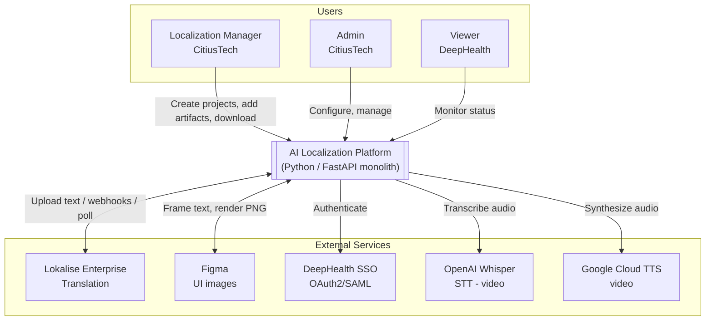
```mermaid
graph TB
    subgraph Users
        LM[Localization Manager<br/>CitiusTech]
        AD[Admin<br/>CitiusTech]
        VW[Viewer<br/>DeepHealth]
    end

    APP[["AI Localization Platform<br/>(Python / FastAPI monolith)"]]

    subgraph "External Services"
        LOK[Lokalise Enterprise<br/>Translation]
        FIG[Figma<br/>UI images]
        SSO[DeepHealth SSO<br/>OAuth2/SAML]
        WHS[OpenAI Whisper<br/>STT - video]
        TTS[Google Cloud TTS<br/>video]
    end

    LM -->|Create projects, add artifacts, download| APP
    AD -->|Configure, manage| APP
    VW -->|Monitor status| APP

    APP <-->|Upload text / webhooks / poll| LOK
    APP <-->|Frame text, render PNG| FIG
    APP -->|Authenticate| SSO
    APP -->|Transcribe audio| WHS
    APP -->|Synthesize audio| TTS
```

---

## 2. High-Level Layered Architecture

Layers top-to-bottom; each layer only depends on the one below it. Async work is offloaded to Celery via Redis.

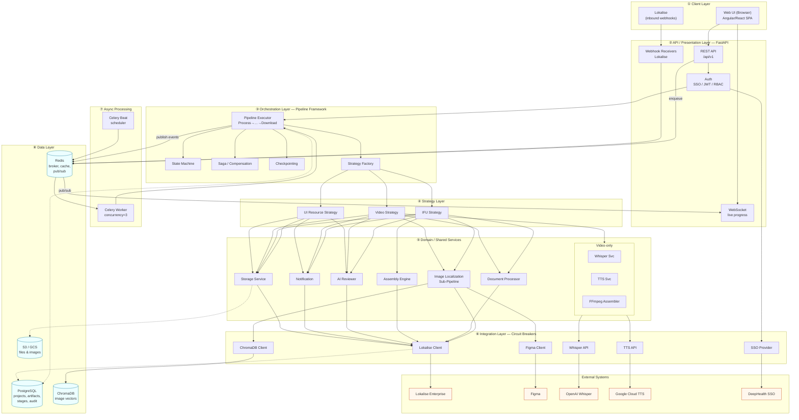
```mermaid
flowchart TB
    %% ---------- Clients ----------
    subgraph L0["① Client Layer"]
        direction LR
        UI["Web UI (Browser)<br/>Angular/React SPA"]
        EXTIN["Lokalise<br/>(inbound webhooks)"]
    end

    %% ---------- API ----------
    subgraph L1["② API / Presentation Layer — FastAPI"]
        direction LR
        REST["REST API<br/>/api/v1"]
        WSK["WebSocket<br/>live progress"]
        WHK["Webhook Receivers<br/>Lokalise"]
        AUTH["Auth<br/>SSO / JWT / RBAC"]
    end

    %% ---------- Orchestration ----------
    subgraph L2["③ Orchestration Layer — Pipeline Framework"]
        direction LR
        EXEC["Pipeline Executor<br/>Process→…→Download"]
        SM["State Machine"]
        SAGA["Saga / Compensation"]
        CKPT["Checkpointing"]
        FACT["Strategy Factory"]
    end

    %% ---------- Strategies ----------
    subgraph L3["④ Strategy Layer"]
        direction LR
        SIFU["IFU Strategy"]
        SVID["Video Strategy"]
        SUIR["UI Resource Strategy"]
    end

    %% ---------- Domain Services ----------
    subgraph L4["⑤ Domain / Shared Services"]
        direction LR
        DOC["Document Processor"]
        IMGP["Image Localization<br/>Sub-Pipeline"]
        ASM["Assembly Engine"]
        AIR["AI Reviewer"]
        NOT["Notification"]
        STO["Storage Service"]
        subgraph L4V["Video-only"]
            direction LR
            WHV["Whisper Svc"]
            TTV["TTS Svc"]
            FFM["FFmpeg Assembler"]
        end
    end

    %% ---------- Integration ----------
    subgraph L5["⑥ Integration Layer — Circuit Breakers"]
        direction LR
        LOKS["Lokalise Client"]
        FIGS["Figma Client"]
        CHS["ChromaDB Client"]
        WHS["Whisper API"]
        TTS["TTS API"]
        SSO["SSO Provider"]
    end

    %% ---------- Async ----------
    subgraph LA["⑦ Async Processing"]
        direction LR
        CW["Celery Worker<br/>concurrency=3"]
        CB["Celery Beat<br/>scheduler"]
    end

    %% ---------- Data ----------
    subgraph L6["⑧ Data Layer"]
        direction LR
        PG[("PostgreSQL<br/>projects, artifacts,<br/>stages, audit")]
        CD[("ChromaDB<br/>image vectors")]
        RD[("Redis<br/>broker, cache,<br/>pub/sub")]
        S3[("S3 / GCS<br/>files & images")]
    end

    %% ---------- External ----------
    subgraph EXT["External Systems"]
        direction LR
        ELOK["Lokalise Enterprise"]
        EFIG["Figma"]
        EWHS["OpenAI Whisper"]
        ETTS["Google Cloud TTS"]
        ESSO["DeepHealth SSO"]
    end

    %% flows
    UI --> REST & WSK
    EXTIN --> WHK
    REST --> AUTH --> EXEC
    REST -->|enqueue| RD --> CW --> EXEC
    CB --> RD
    WHK --> RD
    EXEC --> SM & SAGA & CKPT
    EXEC --> FACT --> SIFU & SVID & SUIR
    SIFU --> DOC & IMGP & ASM & AIR
    SVID --> DOC & IMGP & AIR & L4V
    SUIR --> AIR & STO
    SIFU & SVID & SUIR --> NOT & STO
    IMGP --> FIGS & CHS & LOKS
    DOC & ASM & AIR & NOT & STO --> LOKS
    L4V --> WHS & TTS
    AUTH --> SSO
    EXEC -->|publish events| RD -->|pub/sub| WSK

    %% integration → external
    LOKS --> ELOK
    FIGS --> EFIG
    CHS --> CD
    WHS --> EWHS
    TTS --> ETTS
    SSO --> ESSO

    %% services → data
    EXEC -.-> PG
    LOKS -.-> PG
    STO -.-> S3

    classDef layer fill:#f8fafc,stroke:#334155,color:#0f172a;
    classDef data fill:#ecfeff,stroke:#0e7490;
    classDef ext fill:#fff7ed,stroke:#c2410c;
    class PG,CD,RD,S3 data;
    class ELOK,EFIG,EWHS,ETTS,ESSO ext;
```

**Layer responsibilities**

| # | Layer | Responsibility |
|---|-------|----------------|
| ① | Client | Browser SPA; inbound Lokalise webhooks |
| ② | API / Presentation | REST, WebSocket, webhook endpoints, auth (SSO/JWT/RBAC) |
| ③ | Orchestration | Pipeline executor, state machine, saga, checkpointing, strategy selection |
| ④ | Strategy | Per-artifact behavior (IFU / Video / UI Resource) |
| ⑤ | Domain / Shared Services | Reusable business logic (doc processing, image pipeline, assembly, AI review, notifications, storage; video-only STT/TTS/FFmpeg) |
| ⑥ | Integration | External clients wrapped in circuit breakers |
| ⑦ | Async Processing | Celery worker + beat pull from Redis and run pipelines |
| ⑧ | Data | PostgreSQL, ChromaDB, Redis, S3/GCS |

---

## 3. Deployment (Docker Compose)

> **Updated (Technical_Design_Document.md §11.4):** Redis is **not** a
> Docker Compose service — it is always an external instance (self-run
> container in dev, managed ElastiCache/Memorystore in staging/prod). This
> applies from the first deployment, not only when volume grows.

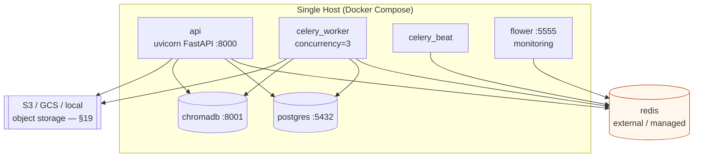
```mermaid
graph TB
    subgraph "Single Host (Docker Compose)"
        api[api<br/>uvicorn FastAPI :8000]
        worker[celery_worker<br/>concurrency=3]
        beat[celery_beat]
        flower[flower :5555<br/>monitoring]
        db[(postgres :5432)]
        chroma[(chromadb :8001)]
    end

    redis[(redis<br/>external / managed)]

    api --> redis
    api --> db
    api --> chroma
    worker --> redis
    worker --> db
    worker --> chroma
    beat --> redis
    flower --> redis

    ext[[S3 / GCS / local<br/>object storage — §19]]
    api --> ext
    worker --> ext

    classDef external fill:#fff7ed,stroke:#c2410c;
    class redis external;
```

> Staging/Prod: same topology on a single VM; PostgreSQL may be a managed service too. Kubernetes is a future scaling option.

### 3.1 Redis Responsibilities

Redis is the **in-memory backbone** for async processing and real-time updates. It is the only **ephemeral** store (never a source of truth — Postgres/S3 hold persistent data) and, per §3 above, is **always external to Docker Compose**, not just at scale. See `LOCKED §7, §8, §9`.

| Role | Description | Scenario / trigger | Story |
|------|-------------|--------------------|-------|
| **Celery broker** | Queue of background jobs; API enqueues `execute_pipeline`, worker pulls | Every artifact submission (async processing) | 0.3, 2.1 |
| **Celery result backend** | Task state/results (`PENDING/STARTED/SUCCESS/FAILURE`) | Querying task/job status | 0.3, 2.1 |
| **Pub/Sub event bus** | Pipeline publishes stage events; WebSocket layer subscribes and pushes to UI | Live progress bars / status in the UI | 3.1 |
| **Idempotency keys** | Safe retries + **webhook deduplication**; guards the join barrier so assembly fires once | Lokalise completion (webhook/poll), retries, parallel-branch join | 2.4, 2.5, 4.2 |
| **Beat scheduling** | Broker for Celery Beat schedules | 15-min Lokalise **polling fallback**, cleanup jobs | 0.3, 4.2 |
| **Cache** | Short-lived transient caching | Hot data as needed | as needed |

> **Ephemeral by design:** if Redis is lost, persistent data is safe in PostgreSQL/S3, and **checkpointing** (`LOCKED §7`) lets in-flight jobs resume from the last completed stage. Redis does **not** store projects/artifacts/audit (Postgres), files/images (S3/GCS), or image embeddings (ChromaDB).

---

## 4. Universal Pipeline Stages

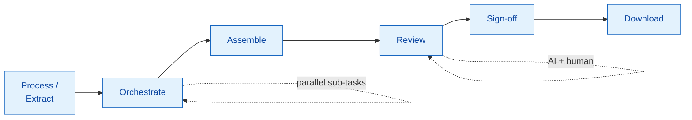
```mermaid
flowchart LR
    A[Process /<br/>Extract] --> B[Orchestrate]
    B --> C[Assemble]
    C --> D[Review]
    D --> E[Sign-off]
    E --> F[Download]

    B -. parallel sub-tasks .-> B
    D -. AI + human .-> D

    classDef stage fill:#e3f2fd,stroke:#1565c0,color:#0d47a1;
    class A,B,C,D,E,F stage;
```

Every artifact type runs these six stages; the **strategy** determines the behavior of each stage. Checkpointing lets a failed run resume from the last completed stage. **Orchestrate** is where localization *starts* (fan-out to Lokalise + the image sub-pipeline); **Assemble** combines the translated results into the final artifact.

---

## 5. Artifact State Machine

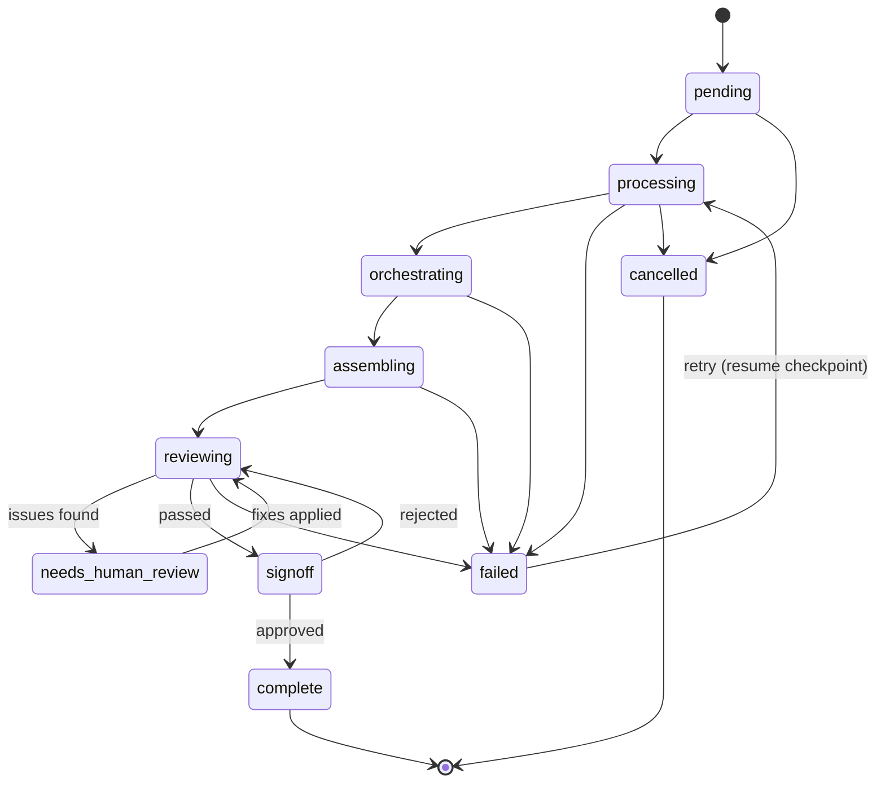
```mermaid
stateDiagram-v2
    [*] --> pending
    pending --> processing
    processing --> orchestrating
    orchestrating --> assembling
    assembling --> reviewing
    reviewing --> needs_human_review: issues found
    needs_human_review --> reviewing: fixes applied
    reviewing --> signoff: passed
    signoff --> complete: approved
    signoff --> reviewing: rejected
    processing --> failed
    orchestrating --> failed
    assembling --> failed
    reviewing --> failed
    failed --> processing: retry (resume checkpoint)
    pending --> cancelled
    processing --> cancelled
    complete --> [*]
    cancelled --> [*]
```

**Project status** is derived from its artifacts: `pending → in_progress → partial_complete → complete` (or `cancelled`).

---

## 6. IFU Localization Sequence

The **Pipeline Executor** runs the six universal stages and **delegates each stage to `IFUStrategy`**. The async fan-out/join detail lives in [§6.1](#61-ifu-parallel-branch-join--barrier).

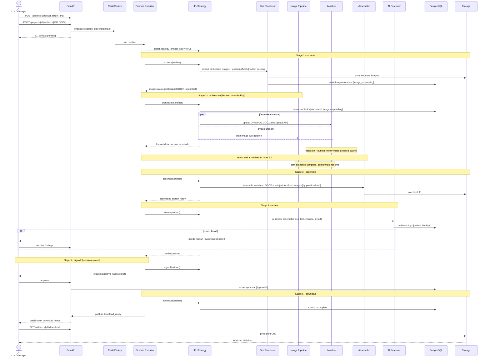
```mermaid
sequenceDiagram
    actor LM as Loc. Manager
    participant API as FastAPI
    participant Q as Redis/Celery
    participant EX as Pipeline Executor
    participant IFU as IFUStrategy
    participant DOC as Doc Processor
    participant IMG as Image Pipeline
    participant LOK as Lokalise
    participant ASM as Assembler
    participant AIR as AI Reviewer
    participant DB as PostgreSQL
    participant S3 as Storage

    LM->>API: POST /projects [product, target lang]
    LM->>API: POST /projects/{id}/artifacts [IFU DOCX]
    API->>Q: enqueue execute_pipeline(artifact)
    API-->>LM: 201 artifact pending
    Q->>EX: run pipeline
    EX->>IFU: select strategy [artifact_type = IFU]

    Note over EX,S3: Stage 1 - process
    EX->>IFU: process(artifact)
    IFU->>DOC: extract embedded images + positions/hash [no text parsing]
    DOC->>S3: store extracted images
    DOC->>DB: write image metadata [image_processing]
    IFU-->>EX: images cataloged [original DOCX kept intact]

    Note over EX,IMG: Stage 2 - orchestrate [fan-out, non-blocking]
    EX->>IFU: orchestrate(artifact)
    IFU->>DB: create subtasks [document, images = pending]
    par Document branch
        IFU->>LOK: upload ORIGINAL DOCX [doc upload API]
    and Image branch
        IFU->>IMG: start image sub-pipeline
    end
    IFU-->>EX: fan-out done, worker suspends
    Note over LOK: translate + human review inside Lokalise [async]
    Note over EX,ASM: async wait + join barrier - see 6.1
    Note over LOK,IMG: both branches complete, barrier trips, resume

    Note over EX,S3: Stage 3 - assemble
    EX->>IFU: assemble(artifact)
    IFU->>ASM: assemble translated DOCX + re-inject localized images [by position/hash]
    ASM->>S3: store final IFU
    IFU-->>EX: assembled artifact ready

    Note over EX,AIR: Stage 4 - review
    EX->>IFU: review(artifact)
    IFU->>AIR: AI review assembled doc [text, images, layout]
    AIR->>DB: write findings [review_findings]
    alt issues found
        AIR-->>LM: needs human review [WebSocket]
        LM->>API: resolve findings
    end
    IFU-->>EX: review passed

    Note over EX,LM: Stage 5 - signoff [human approval]
    EX->>IFU: signoff(artifact)
    IFU-->>LM: request approval [WebSocket]
    LM->>API: approve
    API->>DB: record approval [approvals]

    Note over EX,S3: Stage 6 - download
    EX->>IFU: download(artifact)
    IFU->>DB: status = complete
    EX->>API: publish download_ready
    API-->>LM: WebSocket download_ready
    LM->>API: GET /artifacts/{id}/download
    API->>S3: presigned URL
    S3-->>LM: localized IFU.docx
```

---

## 6.1 IFU Parallel-Branch Join / Barrier

How the two async branches (document translation + image localization) fan out and
then **join** so that assembly + review trigger **exactly once** when both are done.
The worker never blocks; external webhooks/polling drive progress; the DB-backed
`artifact_subtasks` acts as the barrier (atomic check + idempotency).

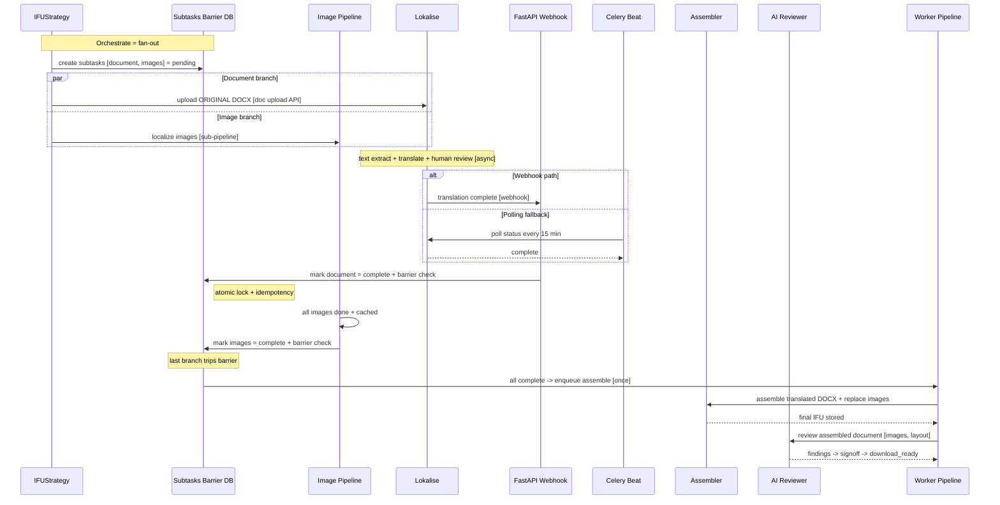
```mermaid
sequenceDiagram
    participant IFU as IFUStrategy
    participant SUB as Subtasks Barrier DB
    participant IMG as Image Pipeline
    participant LOK as Lokalise
    participant API as FastAPI Webhook
    participant BEAT as Celery Beat
    participant ASM as Assembler
    participant REV as AI Reviewer
    participant W as Worker Pipeline

    Note over IFU,SUB: Orchestrate = fan-out
    IFU->>SUB: create subtasks [document, images] = pending
    par Document branch
        IFU->>LOK: upload ORIGINAL DOCX [doc upload API]
    and Image branch
        IFU->>IMG: localize images [sub-pipeline]
    end

    Note over LOK: text extract + translate + human review [async]

    alt Webhook path
        LOK->>API: translation complete [webhook]
    else Polling fallback
        BEAT->>LOK: poll status every 15 min
        LOK-->>BEAT: complete
    end
    API->>SUB: mark document = complete + barrier check
    Note right of SUB: atomic lock + idempotency

    IMG->>IMG: all images done + cached
    IMG->>SUB: mark images = complete + barrier check

    Note over SUB: last branch trips barrier
    SUB->>W: all complete -> enqueue assemble [once]

    W->>ASM: assemble translated DOCX + replace images
    ASM-->>W: final IFU stored
    W->>REV: review assembled document [images, layout]
    REV-->>W: findings -> signoff -> download_ready
```

**Key guarantees**

| Concern | Mechanism |
|---------|-----------|
| Worker never blocks on long waits | Branches suspended; resumed by webhook/polling |
| Missed webhook | `Celery Beat` 15-min polling fallback |
| Duplicate webhook / retry | Idempotency key on completion handler |
| Both branches finish together (race) | Atomic row lock on barrier check (`SELECT ... FOR UPDATE`) |
| Assemble fires once | Idempotency guard on the barrier trigger |
| Crash mid-flight | Checkpoint + DB-backed subtasks survive restart |

---

## 7. Image Localization Sub-Pipeline

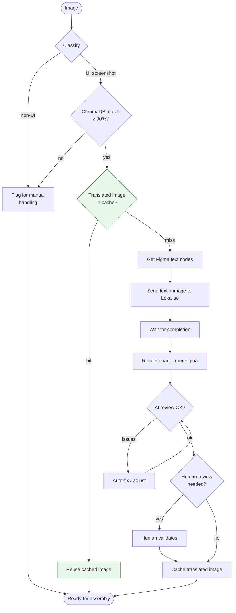
```mermaid
flowchart TD
    Start([Image]) --> CLS{Classify}
    CLS -->|non-UI| MAN[Flag for manual<br/>handling]
    CLS -->|UI screenshot| MATCH{ChromaDB match<br/>&ge; 90%?}
    MATCH -->|no| MAN
    MATCH -->|yes| CACHE{Translated image<br/>in cache?}
    CACHE -->|hit| REUSE[Reuse cached image]
    CACHE -->|miss| FT[Get Figma text nodes]
    FT --> SEND[Send text + image to Lokalise]
    SEND --> WAIT[Wait for completion]
    WAIT --> RENDER[Render image from Figma]
    RENDER --> AIREV{AI review OK?}
    AIREV -->|issues| FIX[Auto-fix / adjust]
    FIX --> AIREV
    AIREV -->|ok| HR{Human review<br/>needed?}
    HR -->|yes| HUM[Human validates]
    HR -->|no| STORE
    HUM --> STORE[Cache translated image]
    REUSE --> READY([Ready for assembly])
    STORE --> READY
    MAN --> READY

    classDef reuse fill:#e8f5e9,stroke:#2e7d32;
    class REUSE,CACHE reuse;
```

Reused by both **IFU** and **Video** pipelines.

---

## 8. Video Localization Flow

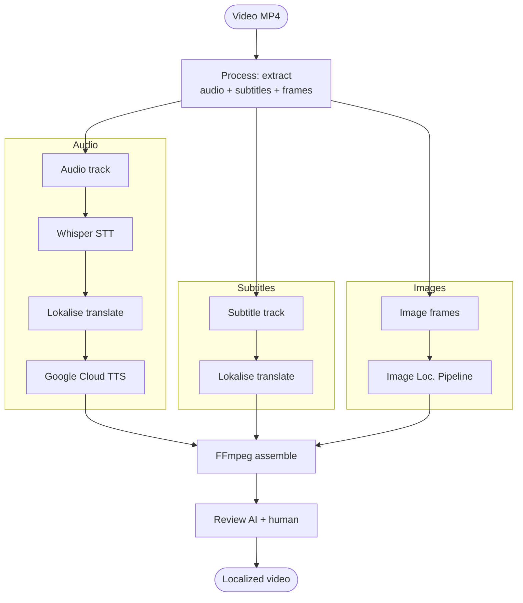
```mermaid
flowchart TD
    V([Video MP4]) --> EX[Process: extract<br/>audio + subtitles + frames]
    EX --> A1[Audio track]
    EX --> S1[Subtitle track]
    EX --> F1[Image frames]

    subgraph Audio
        A1 --> STT[Whisper STT]
        STT --> AL[Lokalise translate]
        AL --> TTS[Google Cloud TTS]
    end

    subgraph Subtitles
        S1 --> SL[Lokalise translate]
    end

    subgraph Images
        F1 --> IP[Image Loc. Pipeline]
    end

    TTS --> MERGE[FFmpeg assemble]
    SL --> MERGE
    IP --> MERGE
    MERGE --> REV[Review AI + human]
    REV --> DONE([Localized video])
```

---

## 9. UI Resource Flow

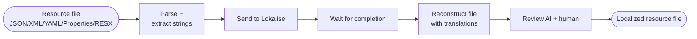
```mermaid
flowchart LR
    R([Resource file<br/>JSON/XML/YAML/Properties/RESX]) --> P[Parse +<br/>extract strings]
    P --> L[Send to Lokalise]
    L --> W[Wait for completion]
    W --> RC[Reconstruct file<br/>with translations]
    RC --> REV[Review AI + human]
    REV --> D([Localized resource file])
```

---

## 10. Real-time Updates (Event Flow)

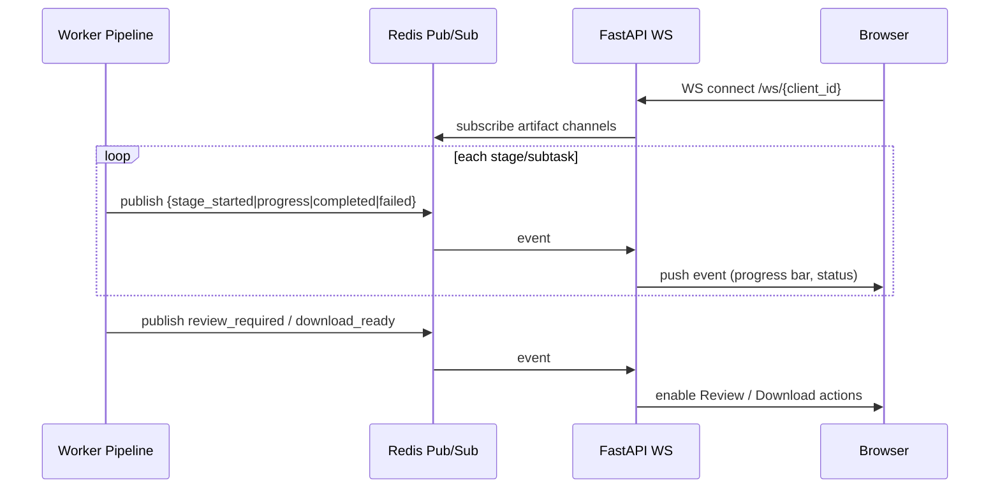
```mermaid
sequenceDiagram
    participant W as Worker Pipeline
    participant RD as Redis Pub/Sub
    participant API as FastAPI WS
    participant UI as Browser

    UI->>API: WS connect /ws/{client_id}
    API->>RD: subscribe artifact channels
    loop each stage/subtask
        W->>RD: publish {stage_started|progress|completed|failed}
        RD->>API: event
        API->>UI: push event (progress bar, status)
    end
    W->>RD: publish review_required / download_ready
    RD->>API: event
    API->>UI: enable Review / Download actions
```

---

## 11. Lokalise Webhook + Polling

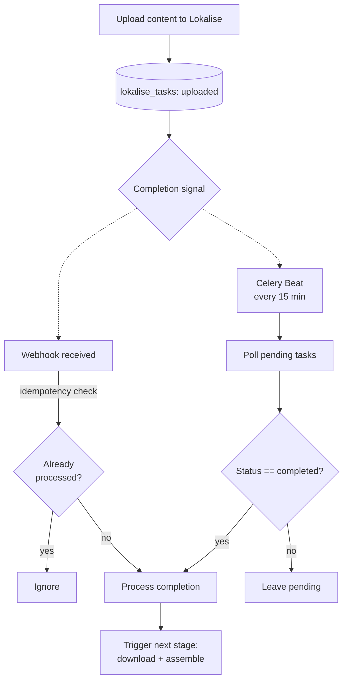
```mermaid
flowchart TD
    UP[Upload content to Lokalise] --> STORE[(lokalise_tasks: uploaded)]
    STORE --> WAIT{Completion signal}

    WH[Webhook received] -->|idempotency check| IDEMP{Already<br/>processed?}
    IDEMP -->|yes| IGN[Ignore]
    IDEMP -->|no| PROC[Process completion]

    BEAT[Celery Beat<br/>every 15 min] --> POLL[Poll pending tasks]
    POLL --> CHK{Status == completed?}
    CHK -->|yes| PROC
    CHK -->|no| SKIP[Leave pending]

    WAIT -.-> WH
    WAIT -.-> BEAT
    PROC --> NEXT[Trigger next stage:<br/>download + assemble]
```

Webhook is primary; 15-minute polling is the fallback. Idempotency keys (Redis) prevent double-processing.

---

## 12. Data Model (ER)

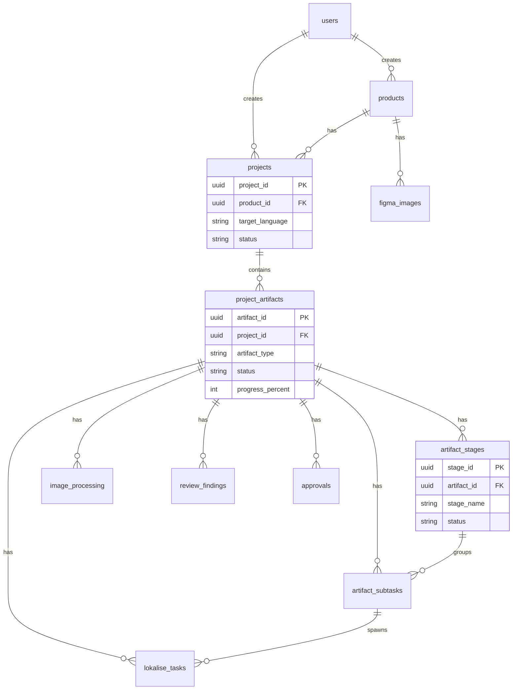
```mermaid
erDiagram
    users ||--o{ products : creates
    users ||--o{ projects : creates
    products ||--o{ projects : has
    products ||--o{ figma_images : has
    projects ||--o{ project_artifacts : contains
    project_artifacts ||--o{ artifact_stages : has
    project_artifacts ||--o{ artifact_subtasks : has
    project_artifacts ||--o{ image_processing : has
    project_artifacts ||--o{ lokalise_tasks : has
    project_artifacts ||--o{ review_findings : has
    project_artifacts ||--o{ approvals : has
    artifact_stages ||--o{ artifact_subtasks : groups
    artifact_subtasks ||--o{ lokalise_tasks : spawns

    projects {
        uuid project_id PK
        uuid product_id FK
        string target_language
        string status
    }
    project_artifacts {
        uuid artifact_id PK
        uuid project_id FK
        string artifact_type
        string status
        int progress_percent
    }
    artifact_stages {
        uuid stage_id PK
        uuid artifact_id FK
        string stage_name
        string status
    }
```

> Full schema (14 tables) in `Database_Schema.md`.

---

## 13. Project / Artifact Model

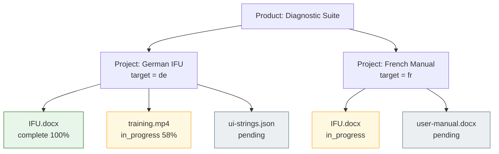
```mermaid
graph TD
    P[Product: Diagnostic Suite]
    P --> PR1[Project: German IFU<br/>target = de]
    P --> PR2[Project: French Manual<br/>target = fr]

    PR1 --> A1[IFU.docx<br/>complete 100%]
    PR1 --> A2[training.mp4<br/>in_progress 58%]
    PR1 --> A3[ui-strings.json<br/>pending]

    PR2 --> A4[IFU.docx<br/>in_progress]
    PR2 --> A5[user-manual.docx<br/>pending]

    classDef done fill:#e8f5e9,stroke:#2e7d32;
    classDef prog fill:#fff8e1,stroke:#f9a825;
    classDef pend fill:#eceff1,stroke:#607d8b;
    class A1 done;
    class A2,A4 prog;
    class A3,A5 pend;
```

- **One project per product per target language**
- **Multiple artifacts per project**, each processed & downloaded independently (partial completion)
- Same source file can appear in multiple projects (independent translations)

---

# 🔑 Key Sequence Diagrams

## 14. Project Creation & Artifact Submission

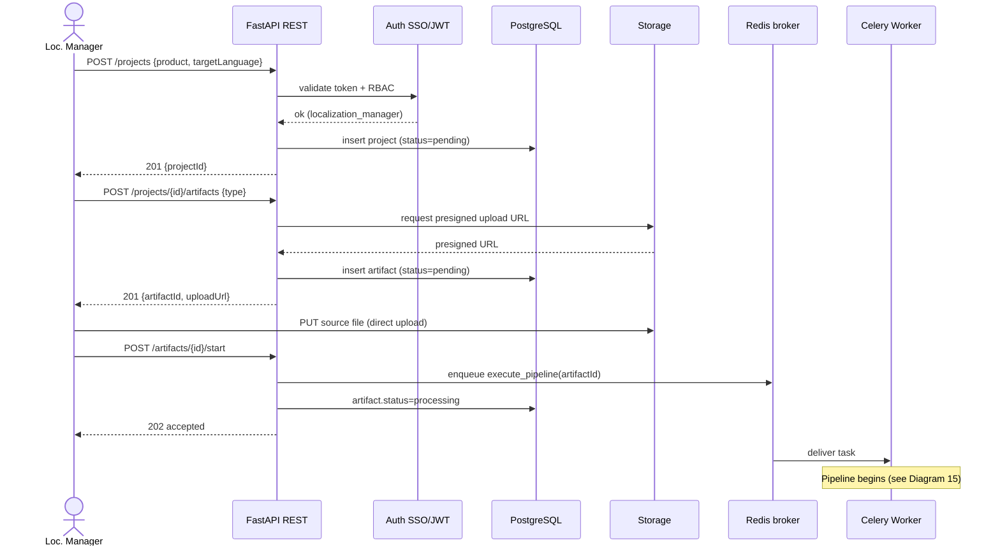
```mermaid
sequenceDiagram
    actor LM as Loc. Manager
    participant API as FastAPI REST
    participant AUTH as Auth SSO/JWT
    participant DB as PostgreSQL
    participant S3 as Storage
    participant Q as Redis broker
    participant CW as Celery Worker

    LM->>API: POST /projects {product, targetLanguage}
    API->>AUTH: validate token + RBAC
    AUTH-->>API: ok (localization_manager)
    API->>DB: insert project (status=pending)
    API-->>LM: 201 {projectId}

    LM->>API: POST /projects/{id}/artifacts {type}
    API->>S3: request presigned upload URL
    S3-->>API: presigned URL
    API->>DB: insert artifact (status=pending)
    API-->>LM: 201 {artifactId, uploadUrl}
    LM->>S3: PUT source file (direct upload)

    LM->>API: POST /artifacts/{id}/start
    API->>Q: enqueue execute_pipeline(artifactId)
    API->>DB: artifact.status=processing
    API-->>LM: 202 accepted
    Q->>CW: deliver task
    Note over CW: Pipeline begins (see Diagram 15)
```

---

## 15. Artifact Pipeline Execution (with events)

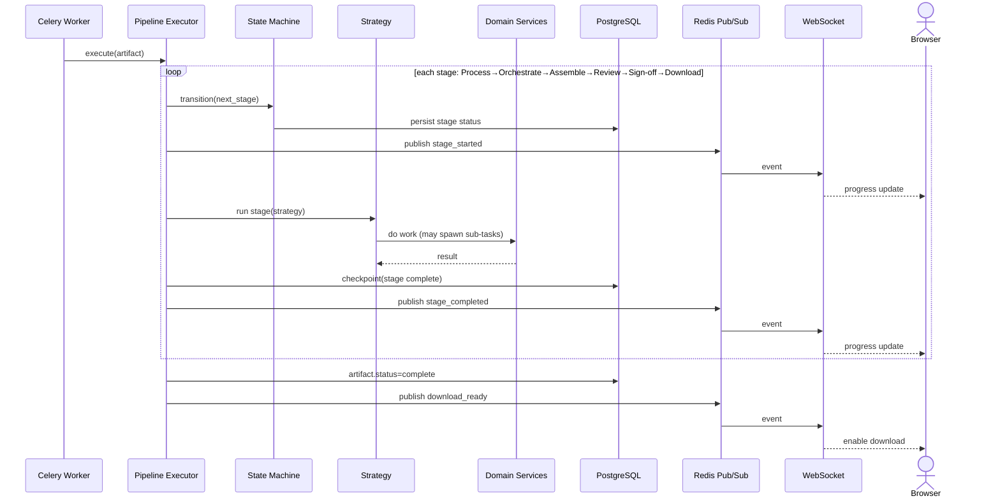
```mermaid
sequenceDiagram
    participant CW as Celery Worker
    participant PL as Pipeline Executor
    participant SM as State Machine
    participant ST as Strategy
    participant SVC as Domain Services
    participant DB as PostgreSQL
    participant RD as Redis Pub/Sub
    participant WS as WebSocket
    actor UI as Browser

    CW->>PL: execute(artifact)
    loop each stage: Process→Orchestrate→Assemble→Review→Sign-off→Download
        PL->>SM: transition(next_stage)
        SM->>DB: persist stage status
        PL->>RD: publish stage_started
        RD->>WS: event
        WS-->>UI: progress update
        PL->>ST: run stage(strategy)
        ST->>SVC: do work (may spawn sub-tasks)
        SVC-->>ST: result
        PL->>DB: checkpoint(stage complete)
        PL->>RD: publish stage_completed
        RD->>WS: event
        WS-->>UI: progress update
    end
    PL->>DB: artifact.status=complete
    PL->>RD: publish download_ready
    RD->>WS: event
    WS-->>UI: enable download
```

---

## 16. Image Localization (per UI screenshot)

Runs inside the IFU/Video **orchestrate** stage (the image branch). Each extracted image is processed independently; when all are done the images sub-task completes and **feeds the join barrier** ([§6.1](#61-ifu-parallel-branch-join--barrier)). Reused by both **IFU** and **Video**.

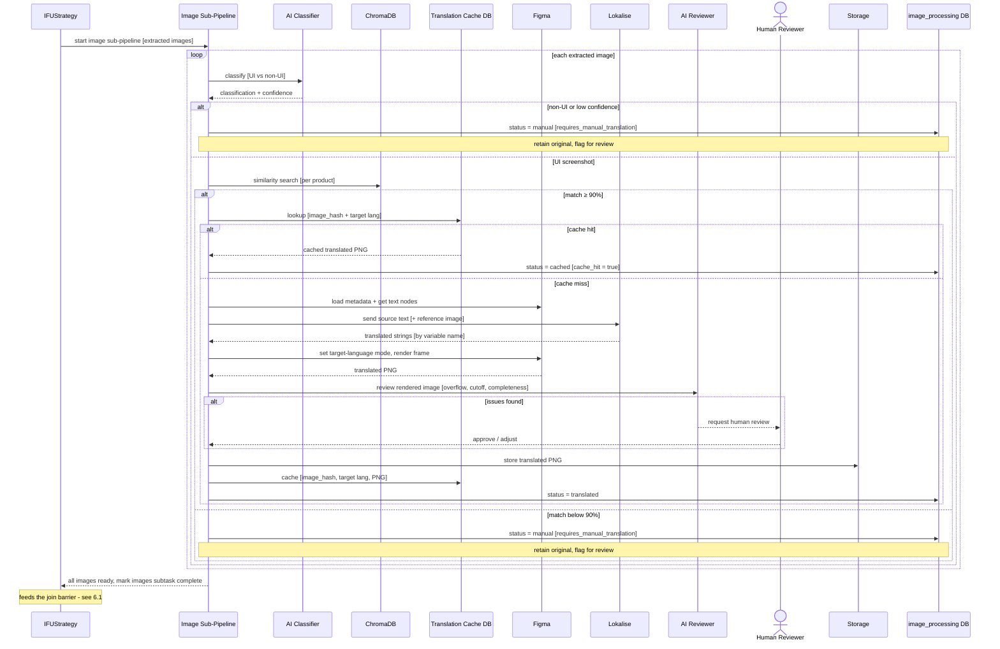
```mermaid
sequenceDiagram
    participant IFU as IFUStrategy
    participant IMG as Image Sub-Pipeline
    participant CLS as AI Classifier
    participant CH as ChromaDB
    participant CACHE as Translation Cache DB
    participant FIG as Figma
    participant LOK as Lokalise
    participant AI as AI Reviewer
    actor HR as Human Reviewer
    participant S3 as Storage
    participant DB as image_processing DB

    IFU->>IMG: start image sub-pipeline [extracted images]
    loop each extracted image
        IMG->>CLS: classify [UI vs non-UI]
        CLS-->>IMG: classification + confidence
        alt non-UI or low confidence
            IMG->>DB: status = manual [requires_manual_translation]
            Note over IMG,DB: retain original, flag for review
        else UI screenshot
            IMG->>CH: similarity search [per product]
            alt match ≥ 90%
                IMG->>CACHE: lookup [image_hash + target lang]
                alt cache hit
                    CACHE-->>IMG: cached translated PNG
                    IMG->>DB: status = cached [cache_hit = true]
                else cache miss
                    IMG->>FIG: load metadata + get text nodes
                    IMG->>LOK: send source text [+ reference image]
                    LOK-->>IMG: translated strings [by variable name]
                    IMG->>FIG: set target-language mode, render frame
                    FIG-->>IMG: translated PNG
                    IMG->>AI: review rendered image [overflow, cutoff, completeness]
                    alt issues found
                        AI-->>HR: request human review
                        HR-->>IMG: approve / adjust
                    end
                    IMG->>S3: store translated PNG
                    IMG->>CACHE: cache [image_hash, target lang, PNG]
                    IMG->>DB: status = translated
                end
            else match below 90%
                IMG->>DB: status = manual [requires_manual_translation]
                Note over IMG,DB: retain original, flag for review
            end
        end
    end
    IMG-->>IFU: all images ready, mark images subtask complete
    Note over IFU: feeds the join barrier - see 6.1
```

---

## 17. Lokalise Completion (Webhook + Polling fallback)

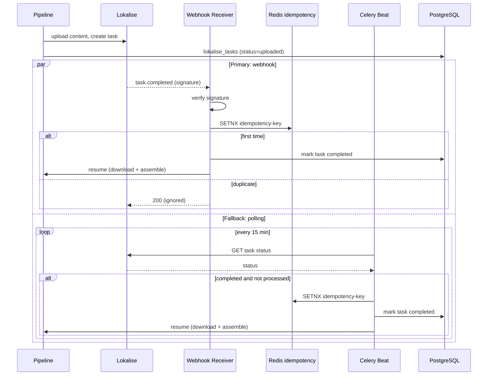
```mermaid
sequenceDiagram
    participant PL as Pipeline
    participant LOK as Lokalise
    participant WHK as Webhook Receiver
    participant RD as Redis idempotency
    participant BEAT as Celery Beat
    participant DB as PostgreSQL

    PL->>LOK: upload content, create task
    PL->>DB: lokalise_tasks (status=uploaded)

    par Primary: webhook
        LOK-->>WHK: task.completed (signature)
        WHK->>WHK: verify signature
        WHK->>RD: SETNX idempotency-key
        alt first time
            WHK->>DB: mark task completed
            WHK->>PL: resume (download + assemble)
        else duplicate
            WHK-->>LOK: 200 (ignored)
        end
    and Fallback: polling
        loop every 15 min
            BEAT->>LOK: GET task status
            LOK-->>BEAT: status
            alt completed and not processed
                BEAT->>RD: SETNX idempotency-key
                BEAT->>DB: mark task completed
                BEAT->>PL: resume (download + assemble)
            end
        end
    end
```

---

## 18. Failure, Retry & Checkpoint Recovery

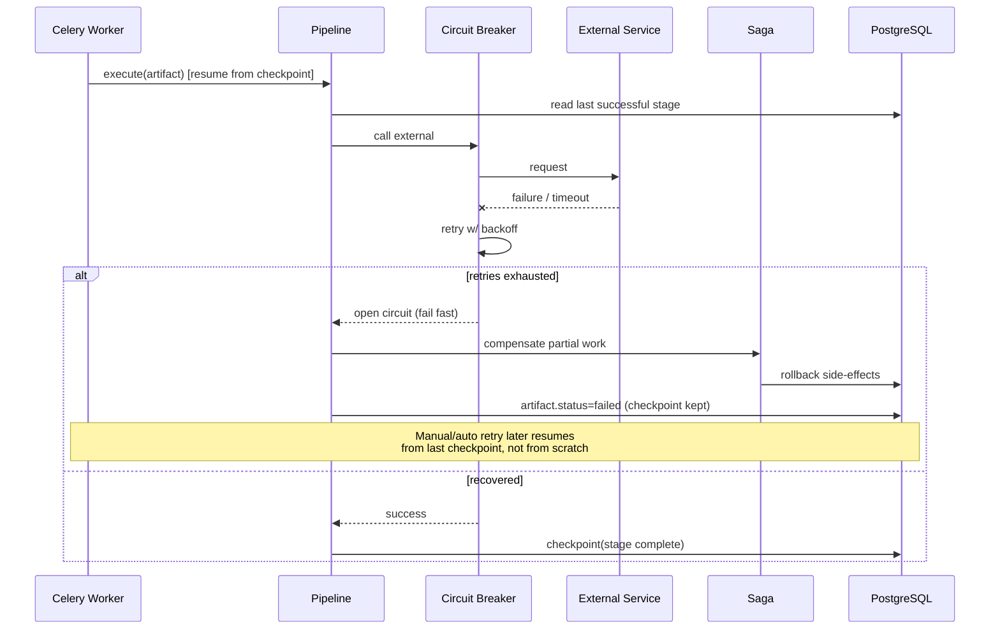
```mermaid
sequenceDiagram
    participant CW as Celery Worker
    participant PL as Pipeline
    participant CB as Circuit Breaker
    participant EXT as External Service
    participant SAGA as Saga
    participant DB as PostgreSQL

    CW->>PL: execute(artifact) [resume from checkpoint]
    PL->>DB: read last successful stage
    PL->>CB: call external
    CB->>EXT: request
    EXT--xCB: failure / timeout
    CB->>CB: retry w/ backoff
    alt retries exhausted
        CB-->>PL: open circuit (fail fast)
        PL->>SAGA: compensate partial work
        SAGA->>DB: rollback side-effects
        PL->>DB: artifact.status=failed (checkpoint kept)
        Note over CW,DB: Manual/auto retry later resumes<br/>from last checkpoint, not from scratch
    else recovered
        CB-->>PL: success
        PL->>DB: checkpoint(stage complete)
    end
```

---

## 19. Post-Implementation Extensions (Deployment)

Full detail in `Technical_Design_Document.md` §11. None of these change any
diagram above — they are config-driven implementation choices behind
existing interfaces (Storage Service in Diagram 2's ⑤ layer, ChromaDB Client
in Diagram 2's ⑥ layer).

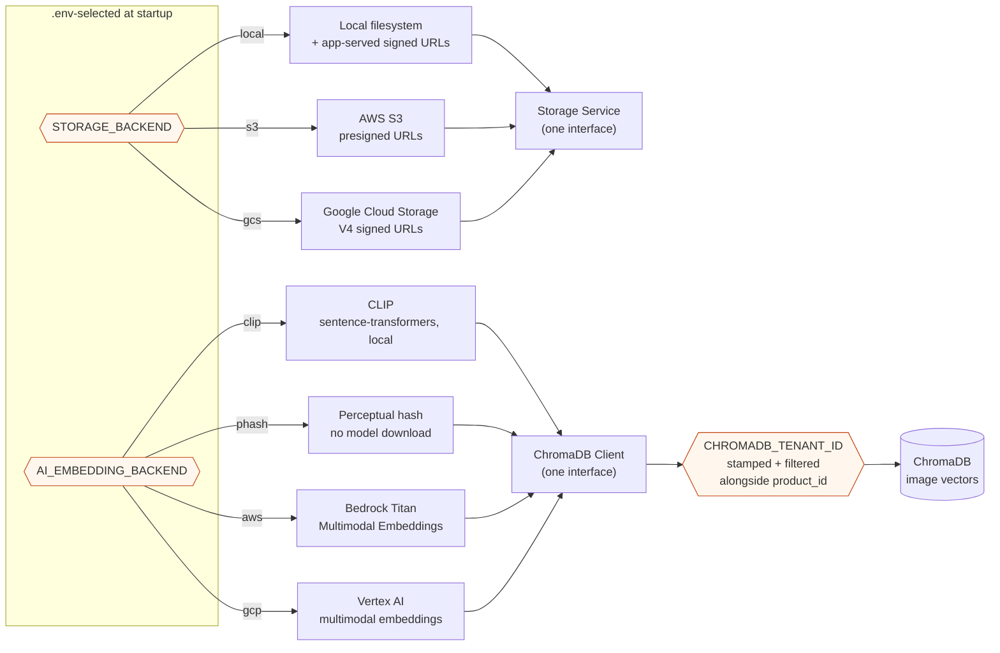
```mermaid
flowchart LR
    subgraph SEL[".env-selected at startup"]
        direction TB
        SB{{"STORAGE_BACKEND"}}
        EB{{"AI_EMBEDDING_BACKEND"}}
    end

    SB -->|local| STL[Local filesystem<br/>+ app-served signed URLs]
    SB -->|s3| STS[AWS S3<br/>presigned URLs]
    SB -->|gcs| STG[Google Cloud Storage<br/>V4 signed URLs]

    EB -->|clip| EMC[CLIP<br/>sentence-transformers, local]
    EB -->|phash| EMP[Perceptual hash<br/>no model download]
    EB -->|aws| EMA[Bedrock Titan<br/>Multimodal Embeddings]
    EB -->|gcp| EMG[Vertex AI<br/>multimodal embeddings]

    STL & STS & STG --> STO["Storage Service<br/>(one interface)"]
    EMC & EMP & EMA & EMG --> CHS["ChromaDB Client<br/>(one interface)"]

    CHS --> TEN{{"CHROMADB_TENANT_ID<br/>stamped + filtered<br/>alongside product_id"}}
    TEN --> CD[("ChromaDB<br/>image vectors")]

    classDef choice fill:#fff7ed,stroke:#c2410c;
    class SB,EB,TEN choice;
```

**Key points**

| Concern | Mechanism | Design ref |
|---------|-----------|------------|
| Storage provider is swappable without touching callers | One `StorageBackend` interface, three implementations | Technical_Design §11.1 |
| Embedding provider is swappable without touching callers | One `ImageEmbedder` interface, four implementations | Technical_Design §11.2 |
| ChromaDB partitioning | `tenant_id` stamped on write, filtered (`$and` with `product_id`) on every read | Technical_Design §11.3 |
| Not relational multi-tenancy | No `tenants` table; no `tenant_id` on any PostgreSQL table (Diagram 12 ER unchanged) | Technical_Design §11.3 |
| Redis always external | See Diagram 3 (updated above) | Technical_Design §11.4 |

---

**Status:** ✅ Diagrams aligned to `LOCKED_Design_v1.0.md`, `Technical_Design_Document.md` (v2.1), and `Database_Schema.md`.
