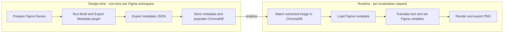
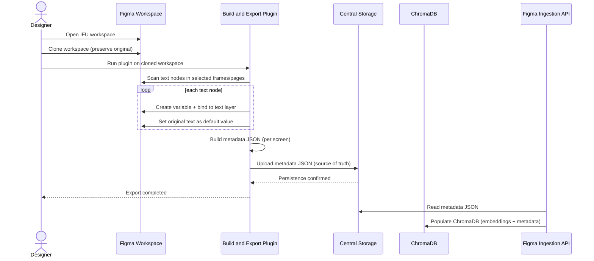
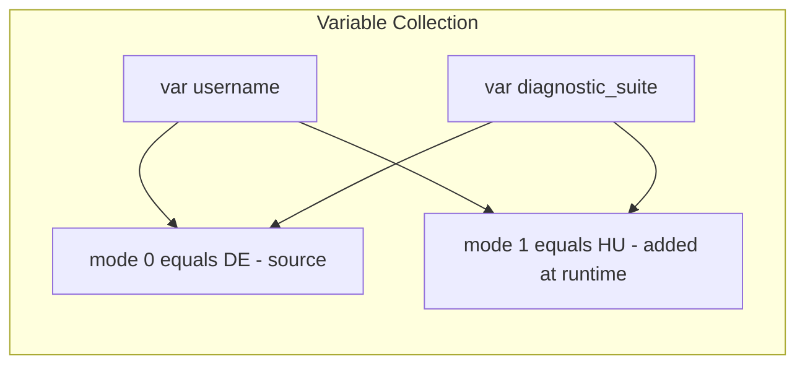
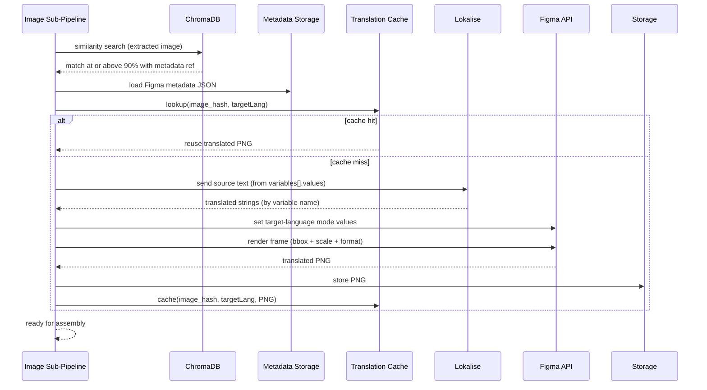

# 🎨 Figma Integration — Design & Technical Reference

**Project:** Knewron AI Localization Platform
**Client:** DeepHealth
**Date:** July 20, 2026
**Version:** 1.0
**Status:** ✅ Aligned to `LOCKED_Design_v1.0.md`, `Database_Schema.md`, `Technical_Design_Document.md`

> Source: distilled from `Knewron_Localization_Platform_Overview.docx` (existing platform reference) and reconciled with the locked design. Where the reference platform differs from our locked model, this document follows the **locked model** and calls out the difference.

> 📊 **Rendered diagrams:** open [`Figma_Integration.html`](Figma_Integration.html) in a browser for guaranteed Mermaid rendering (no VS Code extension required).

## Contents
1. [Purpose & Scope](#1-purpose--scope)
2. [Two Phases: Design-time vs Runtime](#2-two-phases-design-time-vs-runtime)
3. [Design-time Preparation Workflow (Plugin)](#3-design-time-preparation-workflow-plugin)
4. [Figma Metadata JSON Structure](#4-figma-metadata-json-structure)
5. [Variables & Modes (per-language mechanism)](#5-variables--modes-per-language-mechanism)
6. [Runtime Image Localization (how the backend uses metadata)](#6-runtime-image-localization-how-the-backend-uses-metadata)
7. [Rendering & Export Parameters](#7-rendering--export-parameters)
8. [No-match Behavior (reconciled)](#8-no-match-behavior-reconciled)
9. [Storage Mapping (DB + ChromaDB)](#9-storage-mapping-db--chromadb)
10. [Model Alignment Notes](#10-model-alignment-notes)

---

## 1. Purpose & Scope

Figma is used for **UI screenshot localization**: text embedded in product UI images is translated by rendering the image from a Figma frame whose text layers are bound to **variables**. This lets the platform regenerate a screenshot in any target language without manual image editing.

Figma is used by two artifact types (per the reusability matrix): **IFU** and **Video** (frames). It is **not** used for UI Resource files.

---

## 2. Two Phases: Design-time vs Runtime



- **Design-time** is a **prerequisite** performed by the design team (not part of the runtime pipeline). It is what makes automated UI screenshot localization possible.
- **Runtime** is the automated image sub-pipeline already described in `LOCKED_Design_v1.0.md` §5.

---

## 3. Design-time Preparation Workflow (Plugin)

The **"Build & Export Metadata"** Figma plugin prepares a workspace for localization.



**Steps**
1. **Access & clone** — designer opens the IFU workspace and clones it to preserve the original.
2. **Plugin execution** — runs *Build & Export Metadata* on the clone.
3. **Text node discovery** — collects original text, frame info, node id, position, design metadata for each text node.
4. **Variable creation & binding** — auto-creates a Figma **variable** per text node, binds it to the layer, sets original text as default. Enables dynamic text injection without editing layers.
5. **Metadata generation** — produces a metadata JSON collection (the translation blueprint).
6. **Metadata storage** — uploads JSON to central object storage (source of truth).
7. **Export completion** — notifies designer.
8. **ChromaDB ingestion** — a service/API consumes the metadata JSON and populates ChromaDB (image embedding + metadata) for later matching.

> The `figma_images` table (`Database_Schema.md` §8) keeps a short log of which frames were populated into ChromaDB.

---

## 4. Figma Metadata JSON Structure

Each screen is represented by one JSON object; the plugin exports a **collection** of these. This is the concrete blueprint consumed by the ingestion API and stored in ChromaDB.

```json
{
  "figma_file_key": "wxtmgXcQDyghyrlYepFU6f",
  "frame_name": "Page 1",
  "node_id": "255:9",
  "node_name": "Login",
  "absolute_bounding_box": { "x": -26, "y": -1365, "width": 1920, "height": 1045 },
  "scale": 1,
  "format": "png",
  "source": "figma",
  "Localization": {
    "collectionId": "VariableCollectionId:2002:18",
    "modes": {
      "2002:0": "DE"
    },
    "variables": [
      {
        "variableId": "VariableID:2002:29",
        "name": "diagnostic_suite",
        "values": { "DE": "Diagnostic Suite" }
      },
      {
        "variableId": "VariableID:2002:30",
        "name": "username",
        "values": { "DE": "Username*" }
      }
    ]
  }
}
```

**Field reference**

| Field | Meaning |
|-------|---------|
| `figma_file_key` | Figma file identifier |
| `frame_name` | Human-readable frame/page name |
| `node_id` | Figma node identifier of the frame/screen |
| `node_name` | Screen/component name (e.g., "Login") |
| `absolute_bounding_box` | `{x, y, width, height}` — geometry used for export |
| `scale` | Export scale factor |
| `format` | Export format (e.g., `png`) |
| `source` | Origin marker (`figma`) |
| `Localization.collectionId` | Figma variable collection id |
| `Localization.modes` | Map of `modeId → language code` (per-language rendering) |
| `Localization.variables[]` | Text nodes as variables |
| `variables[].variableId` | Figma variable id |
| `variables[].name` | Variable name (stable key, e.g., `username`) |
| `variables[].values` | `{ languageCode → text }` per-language values |

---

## 5. Variables & Modes (per-language mechanism)

Figma **variable collections** support **modes**; each mode maps to a **language**. A variable holds one value per mode/language.



- **Design-time** typically seeds one baseline mode (e.g., `DE`) with source text.
- **Runtime** adds/sets the **target language mode** value for each variable, then renders the frame in that mode to export the localized PNG.
- The `name` field is the **stable key** used to map translated strings back to the correct variable, independent of `variableId`.

---

## 6. Runtime Image Localization (how the backend uses metadata)

Runtime reuse of `LOCKED_Design_v1.0.md` §5 image sub-pipeline, now with metadata specifics:



---

## 7. Rendering & Export Parameters

When exporting the localized frame, the backend uses parameters carried in the metadata:

| Parameter | Source | Use |
|-----------|--------|-----|
| `absolute_bounding_box` | metadata | Crop/geometry of the rendered frame |
| `scale` | metadata | Output resolution multiplier |
| `format` | metadata | Export format (default `png`) |
| target **mode** | runtime | Language the frame is rendered in |

Output PNG is stored in object storage (permanent, for reuse) and cached by `image_hash + target language`.

---

## 8. No-match Behavior (reconciled)

Two behaviors exist; the platform distinguishes them:

| Situation | Reference platform (docx) | Locked design (this project) |
|-----------|---------------------------|------------------------------|
| ChromaDB match **below 90%** | Retain original image unchanged | Retain original **and** flag for manual handling / review |
| Classified **non-UI** (diagram/symbol/logo) | (n/a in docx) | Flag for manual (offline) handling |

**Reconciliation:** We **retain the original image** (never fail the artifact) **and additionally raise a review flag** so a human can decide whether an offline/manual localization is needed. This keeps documents deliverable while surfacing gaps — consistent with Requirements §4.5 (AI flags, human validates).

---

## 9. Storage Mapping (DB + ChromaDB)

**`figma_images` (PostgreSQL)** — see `Database_Schema.md` §8.

| Metadata JSON field | Column |
|---------------------|--------|
| `figma_file_key` | `figma_file_key` |
| `node_id` (frame) | `figma_frame_id` |
| `frame_name` | `frame_name` |
| `variables[]` (source text) | `text_elements` (JSONB) |
| `Localization` (collection/modes/variables) | `variable_mapping` (JSONB) |
| baseline language (e.g., `DE`) | `original_language` |
| SHA-256 of image | `image_hash` |
| ChromaDB vector id | `chromadb_id` |

**ChromaDB metadata** — see `Technical_Design_Document.md` §3 (embedding + `screen_name`, `figma_frame_id`, `figma_file_key`, `text_elements`, per-language `translations`).

> Recommended enhancement: store the full metadata JSON (including `absolute_bounding_box`, `scale`, `format`, `Localization.collectionId`, `modes`) inside `figma_images.metadata` (JSONB) so runtime rendering needs no second lookup.

---

## 10. Model Alignment Notes

⚠️ **The reference docx uses the older multi-language job model** (a master `Localization` row fanning out into per-language `LocalizationJob` sub-jobs; "upload with multiple target languages"). **This project does NOT use that model.**

- **Our model:** one **project per product per single target language**; a project holds **one or more artifacts** (`LOCKED_Design_v1.0.md` §9, Requirements §1.5).
- **Figma implication:** Figma variable **modes** can hold many languages at the file level, but each **localization project** renders/exports only its **single** target-language mode. Multiple languages = multiple projects, each rendering its own mode.

---

**Status:** ✅ Figma details captured and reconciled with the locked design.
